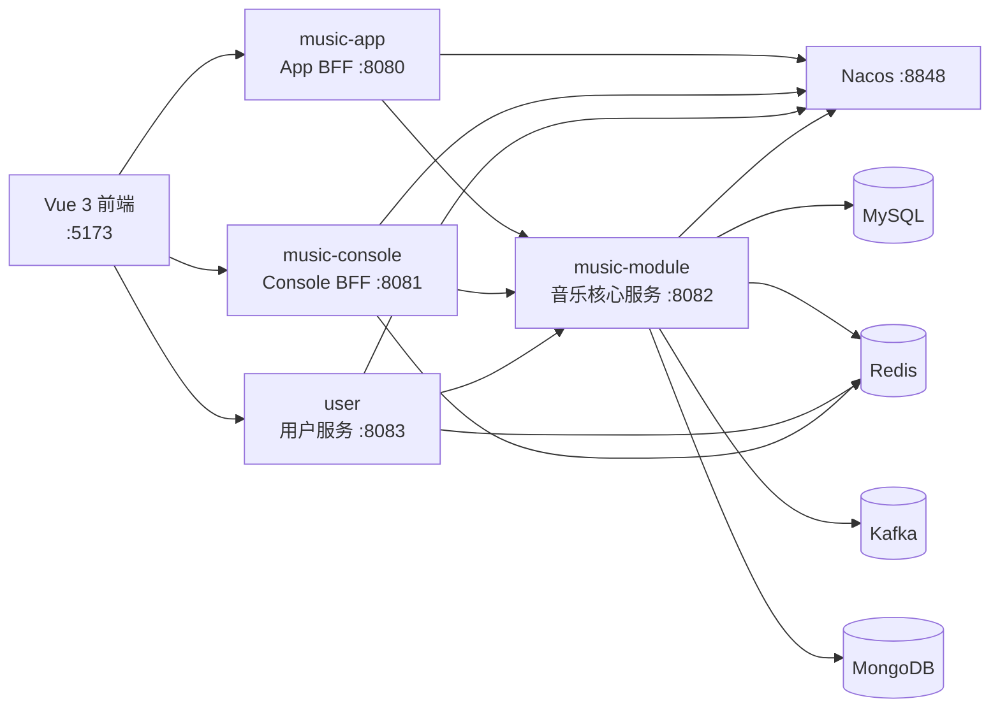

# MusicCard

> 一个面向 C 端音乐浏览与运营后台管理的前后端分离项目。后端采用 Spring Cloud Alibaba 微服务架构，前端采用 Vue 3 单页应用，同时覆盖 App 用户端与 Console 管理端。

## 项目亮点

- **服务拆分**：用户服务、音乐核心服务、App BFF 与 Console BFF 独立部署，通过 OpenFeign 和 Nacos 服务发现协作。
- **双端鉴权**：App 端使用 `sign` 请求头传递登录态；Console 端使用 Cookie / Session，并将会话存储到 Redis。
- **高频列表优化**：音乐列表支持关键词搜索与基于 `wp` 的游标分页，避免传统深分页；服务端结合 Redis 缓存降低重复查询。
- **可靠短信链路**：短信任务通过 Kafka 异步消费，MongoDB 保存任务备份与状态，支持消费确认、失败重试、死信主题和多实例抢占处理。
- **读写分离能力**：通过 `@ReadOnly`、`DataSourceAspect` 与路由数据源，将适合的查询请求切换到从库。
- **完整工程配套**：提供 Nacos 配置模板、音乐演示数据、Quartz 表结构、前端 Mock 与接口联调代理。

## 技术栈

| 分类 | 技术 |
| --- | --- |
| 后端 | Java 17、Spring Boot 3.4.7、Spring Cloud 2024.0.2、Spring Cloud Alibaba 2023.0.3.4 |
| 服务治理 | Nacos（注册发现与配置中心）、OpenFeign、Spring Cloud LoadBalancer |
| 数据存储 | MySQL 8、Redis（Jedis）、MongoDB |
| 数据访问 | MyBatis、MyBatis-Plus、Druid |
| 消息与调度 | Kafka、Spring Kafka、Quartz |
| 对象与工具 | 阿里云 OSS、EasyExcel、Hutool、Lombok |
| 前端 | Vue 3、Vite、Vue Router、Element Plus、Axios |

## 架构与调用链路



其中，`music-app` 和 `music-console` 是面向不同客户端的业务入口；核心音乐业务沉淀在 `music-module`，用户领域沉淀在 `user`。服务启动时必须从 Nacos 读取同名配置。

## 模块说明

| 模块 | 职责 | 默认端口 |
| --- | --- | --- |
| `common` | 统一响应、实体、DTO、Feign 契约、通用配置与基础能力 | - |
| `music-app` | App 用户端接口聚合、`sign` 鉴权、音乐浏览等调用入口 | 8080 |
| `music-console` | 后台管理接口聚合、Cookie / Session 鉴权、统计与运营管理入口 | 8081 |
| `music-module` | 音乐、分类、标签、文件、统计、短信、Kafka 与 MongoDB 核心实现 | 8082 |
| `user` | App / Console 用户注册、登录、会话与用户信息核心实现 | 8083 |
| `music-web` | Vue 3 双端前端：App 浏览端与 Console 管理端 | 5173 |
| `nacos-config` | 四个服务在 Nacos 中需要导入的配置文件 | - |
| `sql` | 音乐业务演示数据与图片资源清单 | - |
| `deploy` | Quartz 表结构与 QuartzDesk 部署材料 | - |

## 核心业务

- App：音乐列表/搜索、分类、标签、音乐详情、文件与短信相关能力。
- Console：音乐、分类、标签、文件、短信任务与音乐统计管理。
- 音乐与标签：通过 `music_tag_relation` 实现多对多关联。
- 音乐列表：使用 `wp` 作为不透明游标，调用方只需原样回传；关键词改变时应清空旧游标。
- 短信：任务状态围绕 `PENDING`、`PROCESSING`、`RETRY_WAIT`、`SUCCESS`、`FAILED_FINAL` 流转，Kafka 主主题和死信主题用于隔离正常消费与异常消息。

## 快速开始

### 1. 准备环境

建议准备以下运行环境：

- JDK 17
- Maven 3.9+（仓库同时提供 Maven Wrapper）
- Node.js 20+ 与 npm
- MySQL 8、Redis、MongoDB、Kafka、Nacos

Nacos 本地默认地址为 `127.0.0.1:8848`，默认命名空间为 `local`。Windows 下可进入 Nacos 的 `bin` 目录执行：

```powershell
./startup.cmd -m standalone
```

随后访问 `http://127.0.0.1:8848/nacos`。

### 2. 配置 Nacos

在 Nacos 控制台切换到 `local` Namespace，并创建以下四条 `Properties` 配置，Group 均为 `DEFAULT_GROUP`：

| Data ID | 本地模板 |
| --- | --- |
| `music-app.properties` | `nacos-config/music-app.properties` |
| `music-console.properties` | `nacos-config/music-console.properties` |
| `music-module.properties` | `nacos-config/music-module.properties` |
| `user.properties` | `nacos-config/user.properties` |

将对应文件内容复制到 Nacos 后，按实际环境替换数据库、Redis、OSS、短信等配置。请勿将 AccessKey、密码、手机号或其他密钥提交到仓库。

可通过环境变量覆盖 Nacos 连接信息：

```powershell
$env:NACOS_ADDR = "127.0.0.1:8848"
$env:NACOS_USERNAME = "<your-nacos-username>"
$env:NACOS_PASSWORD = "<your-nacos-password>"
$env:NACOS_NAMESPACE = "local"
```

更多配置导入说明见 [nacos-config/README.md](nacos-config/README.md)。

### 3. 初始化数据

项目提供音乐业务演示数据：

```powershell
mysql -u <your-user> -p <your-database> < sql/music_demo_seed.sql
```

该脚本会清理并重建 `category`、`tag`、`music`、`music_tag_relation`、`music_statistics` 的演示数据；执行前请确认目标库允许清理这些表中的现有记录。Quartz 表结构位于 `deploy/quartz/tables_mysql_innodb.sql`。

### 4. 构建并启动后端

在项目根目录执行：

```powershell
./mvnw.cmd clean package -DskipTests
```

按下列顺序启动服务。Nacos 是强依赖：未启动或缺少对应 Data ID 时，业务服务会启动失败。

```text
1. Nacos
2. user
3. music-module
4. music-app
5. music-console
```

开发时可分别运行入口类：

```text
user/src/main/java/com/beat/mall/user/UserApplication.java
music-module/src/main/java/com/beat/mall/music/module/MusicModuleApplication.java
music-app/src/main/java/com/beat/mall/music/app/MusicAppApplication.java
music-console/src/main/java/com/beat/mall/music/console/MusicConsoleApplication.java
```

`music-module` 默认连接 `localhost:9092` 的 Kafka 以及 `mongodb://localhost:27017/musiccard_sms`。若使用远程 MongoDB，可设置：

```powershell
$env:MUSICCARD_MONGODB_URI = "mongodb://<your-mongodb-host>:27017/musiccard_sms"
```

### 5. 启动前端

```powershell
Set-Location music-web
npm install
npm run dev
```

常用入口：

- App：`http://localhost:5173/app/explore`
- Console 登录：`http://localhost:5173/console/login`

默认开发配置支持 Mock 数据；联调后端时，将 `music-web/.env.development` 中的 `VITE_USE_MOCK` 设为 `false`。Vite 代理规则如下：

| 前端前缀 | 后端服务 |
| --- | --- |
| `/api/app` | `http://localhost:8080` |
| `/api/console` | `http://localhost:8081` |
| `/api/user` | `http://localhost:8083` |

## 鉴权与接口约定

- App 登录成功后，前端保存后端返回的 `sign`，并在后续请求中通过 `sign` 请求头携带。
- Console 使用 `withCredentials` 携带 Cookie，后端通过 Session 维护登录状态。
- 服务间调用使用内部请求头完成可信调用校验；此类内部密钥仅应配置在 Nacos 或部署环境中。
- 统一响应结构为 `status.code`、`status.msg`、`result`。

完整接口、状态机和业务设计请查看：

- [核心业务技术设计文档](doc/MusicCard核心业务技术设计文档.md)
- [接口文档 V3.0](doc/项目：音乐卡片接口文档V3.0.md)
- [前端说明](music-web/README.md)

## 项目结构

```text
musiccard/
├── common/                 # 跨服务公共契约与基础能力
├── music-app/              # App 端服务
├── music-console/          # Console 端服务
├── music-module/           # 音乐领域核心服务
├── user/                   # 用户领域服务
├── music-web/              # Vue 3 前端
├── nacos-config/           # Nacos 配置模板
├── sql/                    # 演示数据与资源清单
├── deploy/                 # 部署辅助材料
└── doc/                    # 技术设计、接口文档与原型图
```

## 后续规划

- 补充可一键执行的 MySQL 完整建表与迁移脚本，并引入 Flyway 或 Liquibase 管理数据库版本。
- 提供 Docker Compose 编排 Nacos、MySQL、Redis、Kafka、MongoDB 与全部服务。
- 完善健康检查、指标监控、链路追踪、日志采集和告警策略。
- 为短信消费、鉴权、分页缓存和 Feign 调用补充集成测试与故障演练。

## 许可证

本项目用于学习、作品展示与技术实践。若用于生产或二次分发，请根据实际依赖、素材和第三方服务的许可证进行合规评估。
