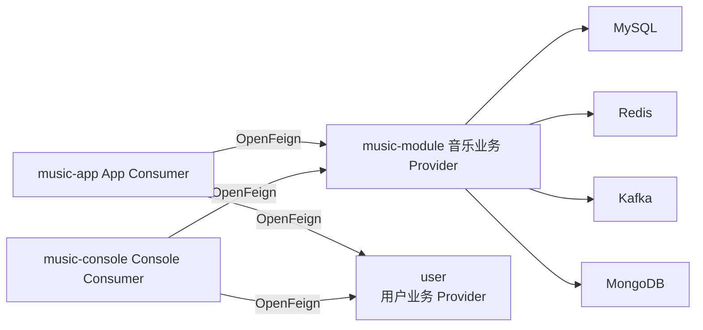
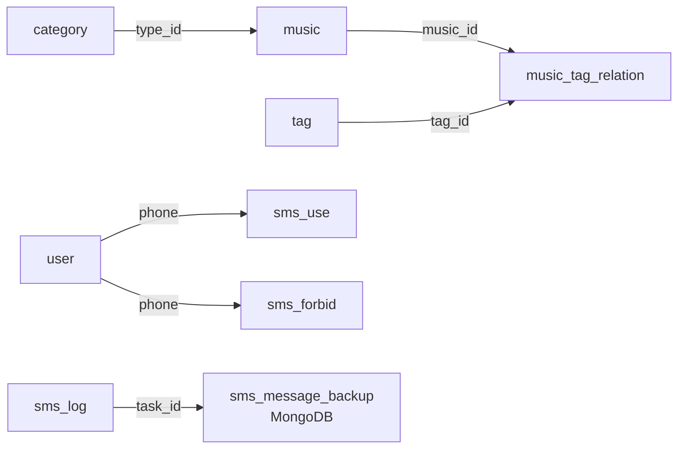
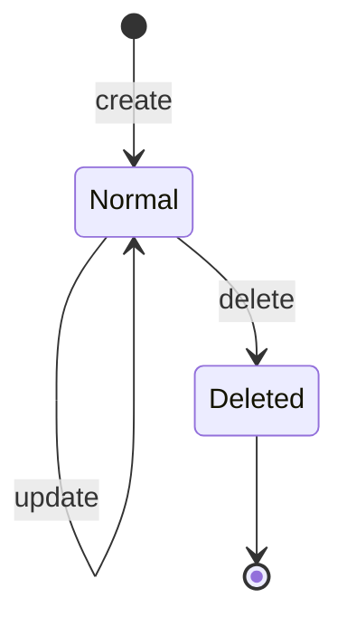
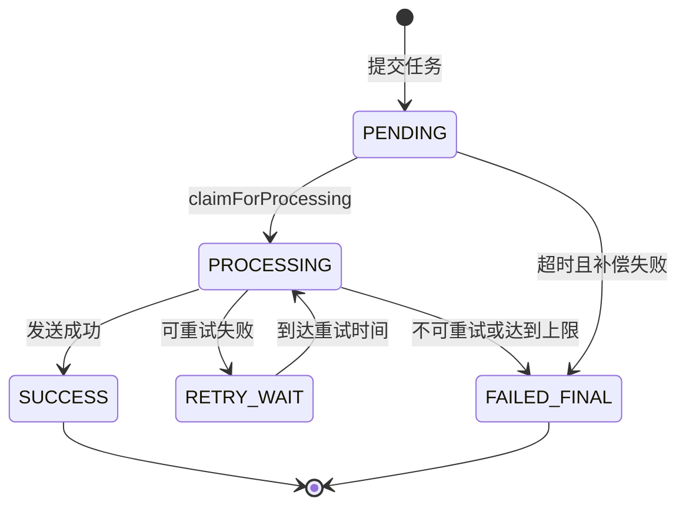

# MusicCard 核心业务技术设计文档

| 项目 | 内容 |
|---|---|
| 版本 | V1.0 |
| App 服务 | `music-app`，默认端口 8080 |
| Console 服务 | `music-console`，默认端口 8081 |
| 音乐业务 Provider | `music-module` |
| 用户业务 Provider | `user` |
| 公共模块 | `common` |

## 1. 系统业务与模块边界

MusicCard 提供 App 音乐浏览与用户服务，以及 Console 音乐后台管理服务。核心业务包括音乐、分类、标签、音乐标签关联、文件、短信、音乐统计和用户登录注册。



| 模块 | 责任 |
|---|---|
| `common` | Entity、App/Console DTO/VO、`Response<T>`、工具类和公共接口契约 |
| `music-app` | App HTTP 接口、`sign` 登录态校验、调用音乐业务 Provider |
| `music-console` | Console HTTP 接口、Session 登录态校验、调用音乐业务 Provider |
| `music-module` | 音乐、分类、标签、文件、短信、统计等核心业务、数据库访问和缓存 |
| `user` | App/Console 用户登录、注册、用户身份校验 |

## 2. 认证、路由与统一响应

### 2.1 请求认证

| 访问端 | Consumer 登录态 | Provider 身份校验 | 内部调用头 |
|---|---|---|---|
| App | `sign`；`@VerifiedUser User` 解析用户 ID | `AuthService.requireSign(sign)` | `X-Client-Type=app`、`X-Internal-Token` |
| Console | Session；`@VerifiedUser User` 解析用户 ID | `AuthService.requireUser(X-User-Id)` | `X-Client-Type=console`、`X-Internal-Token`、`X-User-Id` |

Provider App 与 Console Controller 使用相同 URL 时，由 `X-Client-Type` 路由到对应 Controller；内部调用必须带 `X-Internal-Token`。

### 2.2 统一响应体

```json
{
  "status": {
    "code": 1001,
    "msg": "OK"
  },
  "result": {}
}
```

`1001` 表示成功，`1002` 表示未登录。业务异常使用 `ResponseCode` 返回统一数字码与提示信息。

## 3. 数据库设计

### 3.1 核心实体关系



### 3.2 关系型表

| 表名 | 关键字段 | 索引/约束 | 业务说明 |
|---|---|---|---|
| `music` | `id, music_name, singer_name, type_id, cover_images, is_deleted` | PK `id`；`idx_music_name`、`idx_singer_name`、`idx_type_id` | 音乐基础信息；封面图以 `$` 拼接保存 |
| `category` | `id, type_name, parent_id, is_deleted` | PK `id`；`idx_type_name`、`idx_parent_id` | 音乐分类；`parent_id=0` 表示一级分类 |
| `tag` | `id, tag_name, tag_desc, is_deleted` | PK `id`；唯一索引 `tag_name` | 音乐标签 |
| `music_tag_relation` | `music_id, tag_id, is_deleted` | 联合主键 `(music_id,tag_id)` | 音乐和标签多对多关系 |
| `file` | `id, type, url, is_deleted` | PK `id`；`idx_type` | 上传文件元数据；`1图片 2视频 3文件` |
| `user` | `id, phone, country_code, username, password, is_ban, is_deleted` | PK `id`；唯一索引 `(phone,country_code)` | 用户身份和登录信息 |
| `sms_log` | `task_id, phone, send_type, status, error_code, send_time` | `idx_phone_send_time`、`idx_status_send_time`、`idx_sms_log_task_id` | 实际调用短信渠道后的发送日志 |
| `sms_use` | `phone, minute_start, request_count` | 唯一索引 `(phone,minute_start)` | 同手机号自然分钟频控计数 |
| `sms_forbid` | `phone, begin_time, end_time` | 唯一索引 `phone` | 短信手机号封禁记录 |
| `music_statistics` | `year, month, day, music_count` | 唯一索引 `(year,month,day)` | 每日音乐数量统计快照 |

除 `music_tag_relation` 外，现有业务表采用 `create_time`、`update_time` 和 `is_deleted`。时间字段使用 Unix 秒；删除操作为逻辑删除。

### 3.3 核心查询与写入 SQL

```sql
-- App 音乐列表：按 ID 倒序的游标分页
SELECT id, cover_images, music_name, singer_name, music_desc, type_id
FROM music
WHERE is_deleted = 0
  AND (:keyword = '' OR music_name LIKE CONCAT('%', :keyword, '%'))
  AND (:offset IS NULL OR id < :offset)
ORDER BY id DESC
LIMIT :pageSizePlusOne;

-- Console 删除音乐：逻辑删除
UPDATE music
SET is_deleted = 1, update_time = UNIX_TIMESTAMP()
WHERE id = :musicId AND is_deleted = 0;

-- 新增音乐标签关联：主键保证同一标签不重复关联
INSERT INTO music_tag_relation(music_id, tag_id, create_time, update_time, is_deleted)
VALUES (:musicId, :tagId, UNIX_TIMESTAMP(), UNIX_TIMESTAMP(), 0);

-- 短信分钟频控：原子递增
INSERT INTO sms_use(phone, minute_start, request_count, create_time, update_time)
VALUES (:phone, :minuteStart, 1, UNIX_TIMESTAMP(), UNIX_TIMESTAMP())
ON DUPLICATE KEY UPDATE
  request_count = request_count + 1,
  update_time = UNIX_TIMESTAMP();
```

## 4. 接口文档设计

### 4.1 App 接口（`music-app`，8080）

| 编号 | 方法 | 路径 | 登录要求 | 功能 |
|---|---|---|---|---|
| A01 | GET | `/music/list` | 否 | 游标分页查询音乐 |
| A02 | GET | `/music/list/demo` | 否 | 普通页码分页演示 |
| A03 | GET | `/music/info` | `sign` | 查询音乐详情 |
| A04 | GET | `/category/list` | 否 | 查询分类树 |
| A05 | GET | `/tag/list` | 否 | 查询标签列表 |
| A06 | GET | `/tag/info` | 否 | 查询标签详情 |
| A07 | POST | `/upload` | 否 | 上传文件 |
| A08 | GET | `/music/download` | `sign` | 下载音乐 Excel |
| A09 | POST | `/music/upload` | `sign` | 上传音乐 Excel |
| A10 | GET | `/music/downloadzip` | `sign` | 下载音乐压缩包 |
| A11 | POST | `/music/uploadzip` | `sign` | 上传音乐压缩包 |
| A12 | GET | `/user/login/app` | 否 | App 登录 |
| A13 | GET | `/user/register/app` | 否 | App 注册 |
| A14 | GET | `/sms/send-sync` | `sign` | 同步发送短信 |
| A15 | GET | `/sms/send-batch` | `sign` | 多线程批量发送短信 |
| A16 | GET | `/sms/send-async` | `sign` | 提交异步短信任务 |

#### A01 音乐列表

`GET /music/list?keyword=周杰伦`

首次请求传 `keyword` 或不传参数；后续请求只传上一页响应返回的 `wp`，不能同时传 `keyword` 和 `wp`。

```json
{
  "status": {"code": 1001, "msg": "OK"},
  "result": {
    "list": [{
      "id": 1,
      "musicName": "示例歌曲",
      "singerName": "示例歌手",
      "musicDesc": "歌曲介绍",
      "typeName": "流行",
      "wallImage": {"url": "https://domain.example/a.jpg", "ar": 1.0}
    }],
    "isEnd": false,
    "wp": "下一页游标"
  }
}
```

#### A03 音乐详情

`GET /music/info?id=1&sign={sign}`

返回字段：`coverImages`、`musicName`、`singerName`、`albumTitle`、`releaseDate`、`musicDesc`、`typeName`、`typeImage`、`tags`。

#### A12/A13 App 登录与注册

| 接口 | 参数 |
|---|---|
| `/user/login/app` | `phone,password` |
| `/user/register/app` | `phone,gender,avatar,name,password,country,province,city` |

登录与注册成功均返回 `UserLoginInfoVo`，包含用户基本信息和登录凭据相关结果。

#### A14-A16 短信接口

| 接口 | 参数 | 结果 |
|---|---|---|
| `/sms/send-sync` | `phone` | 等待短信渠道响应后返回发送结果 |
| `/sms/send-batch` | `phones`，逗号分隔，单次不超过 200 | 等待所有发送任务完成后返回结果列表 |
| `/sms/send-async` | `phone` | 只表示任务已受理，返回 `taskId`，不代表短信已发送成功 |

### 4.2 Console 接口（`music-console`，8081）

| 编号 | 方法 | 路径 | 功能 |
|---|---|---|---|
| C01 | GET | `/music/list` | 音乐分页查询和筛选 |
| C02 | GET | `/music/info` | 音乐详情 |
| C03 | POST | `/music/create` | 新增音乐 |
| C04 | PUT | `/music/update` | 修改音乐 |
| C05 | DELETE | `/music/delete` | 逻辑删除音乐 |
| C06 | GET | `/category/list` | 分类列表 |
| C07 | GET | `/category/info` | 分类详情 |
| C08 | POST | `/category/create` | 新增分类 |
| C09 | PUT | `/category/update` | 修改分类 |
| C10 | DELETE | `/category/delete` | 逻辑删除分类 |
| C11 | GET | `/tag/list` | 标签列表 |
| C12 | GET | `/tag/info` | 标签详情 |
| C13 | POST | `/tag/create` | 新增标签 |
| C14 | PUT | `/tag/update` | 修改标签 |
| C15 | DELETE | `/tag/delete` | 逻辑删除标签 |
| C16 | POST | `/upload` | 上传文件 |
| C17 | GET/POST | `/music/download`、`/music/upload` | 音乐 Excel 导入导出 |
| C18 | GET/POST | `/music/downloadzip`、`/music/uploadzip` | 音乐压缩包导入导出 |
| C19 | GET | `/music/statistics` | 查询音乐统计 |
| C20 | GET | `/sms/send-sync`、`/sms/send-batch`、`/sms/send-async` | 管理端短信服务 |

#### C03 新增音乐

`POST /music/create`

参数：`coverImages,musicName,singerName,musicDesc,albumTitle,releaseDate,typeId,tags`。

校验规则：音乐基础信息必填；分类必须存在且未删除；`tags` 解析为标签集合后逐一校验；音乐、标签关系和更新时间必须一致写入。

#### C04 修改音乐

`PUT /music/update`

参数：`id,coverImages,musicName,singerName,musicDesc,albumTitle,releaseDate,typeId,tags`。

修改后更新音乐基础信息，并按提交标签集合维护 `music_tag_relation`。

#### C05 删除音乐

`DELETE /music/delete?id=1`

将 `music.is_deleted` 更新为 `1`；列表和详情查询必须过滤已删除音乐。

### 4.3 App 音乐与文件接口详细规格

| 接口 | 方法 | 登录 | 请求参数 | 成功 `result` | 业务规则 |
|---|---|---:|---|---|---|
| `/music/list` | GET | 否 | `keyword` 可选；`wp` 可选 | `MusicListFeedVO` | 首次传 keyword；后续只传 wp；二者同时出现或 wp 解码失败返回 4009 |
| `/music/list/demo` | GET | 否 | `page`，默认 1 | `MusicListFeedVO` | 普通页码分页演示接口 |
| `/music/info` | GET | 是 | `id` 必填；`sign` 请求头或参数 | `MusicInfoVO` | `sign` 无效返回 1002 |
| `/upload` | POST | 否 | `multipart/form-data`，字段 `file` | `String` 文件 URL | 用于普通文件上传 |
| `/music/download` | GET | 是 | `sign` 请求头或参数 | Excel 二进制流 | 未登录时返回 JSON 格式的 1002 响应 |
| `/music/upload` | POST | 是 | `multipart/form-data`，字段 `file`；`sign` | `String` | 导入音乐 Excel |
| `/music/downloadzip` | GET | 是 | `sign` 请求头或参数 | ZIP 二进制流 | 未登录时返回 JSON 格式的 1002 响应 |
| `/music/uploadzip` | POST | 是 | `multipart/form-data`，字段 `file`；`sign` | `String` | 导入音乐压缩包 |

`MusicListFeedVO`：

```json
{
  "list": [{
    "id": 1,
    "wallImage": {"url": "String", "ar": 1.0},
    "musicName": "String",
    "singerName": "String",
    "musicDesc": "String",
    "typeName": "String"
  }],
  "isEnd": false,
  "wp": "String"
}
```

`MusicInfoVO`：

```json
{
  "coverImages": ["String"],
  "musicName": "String",
  "singerName": "String",
  "albumTitle": "String",
  "releaseDate": "String",
  "musicDesc": "String",
  "typeName": "String",
  "typeImage": "String",
  "tags": ["String"]
}
```

### 4.4 App 分类、标签与关联接口详细规格

| 接口 | 方法 | 登录 | 请求参数 | 返回类型 | 说明 |
|---|---|---:|---|---|---|
| `/category/list` | GET | 否 | 无 | `Response<CategoryListFeedVO>` | 返回分类树；一级分类包含 `children` |
| `/tag/list` | GET | 否 | 无 | `List<Tag>` | 当前实现直接返回列表，不包裹 `Response` |
| `/tag/info` | GET | 否 | `id` 必填 | `Tag` | 当前实现直接返回实体 |
| `/musicTagRelation/list` | GET | 否 | 无 | `List<MusicTagRelation>` | 返回所有关联记录 |
| `/musicTagRelation/info` | GET | 否 | `musicId`、`tagId` 必填 | `MusicTagRelation` | 查询单条关联记录 |

`Tag` 字段：`id,tagName,tagDesc,createTime,updateTime,isDeleted`。  
`MusicTagRelation` 字段：`musicId,tagId,createTime,updateTime,isDeleted`。

### 4.5 App 用户与短信接口详细规格

| 接口 | 方法 | 登录 | 请求参数 | 成功 `result` | 说明 |
|---|---|---:|---|---|---|
| `/user/login/app` | GET | 否 | `phone,password` | `UserLoginInfoVo` | App 用户登录；同时获取客户端 IP 和 sign |
| `/user/register/app` | GET | 否 | `phone,gender,name,password` 必填；`avatar,country,province,city` 可选 | `UserLoginInfoVo` | App 用户注册；同时获取客户端 IP 和 sign |
| `/sms/send-sync` | GET | 是 | `phone`；`sign` | `SmsSendResultDTO` | 同步等待渠道结果 |
| `/sms/send-batch` | GET | 是 | `phones`；`sign` | `List<SmsSendResultDTO>` | 多手机号逗号分隔，单次不超过 200 |
| `/sms/send-async` | GET | 是 | `phone`；`sign` | `SmsTaskSubmitResultDTO` | 仅返回任务受理结果 |

`SmsSendResultDTO`：`ok,verifyCode,bizId,requestId,code,message,errorCode,errorMessage`。  
`SmsTaskSubmitResultDTO`：`accepted,taskId,status,errorCode,errorMessage`。当 `accepted=true` 时仅表示 Kafka 任务已受理，不表示短信已发送成功。

### 4.6 Console 音乐接口详细规格

所有 Console 音乐接口均要求 Session 登录；Controller 使用 `@VerifiedUser` 获取用户，Provider 使用 `X-User-Id` 校验。

| 接口 | 方法 | 请求参数 | 成功 `result` | 规则 |
|---|---|---|---|---|
| `/music/list` | GET | `page` 默认 1；`musicName,typeName,tagName` 可选 | `MusicListFeedVO` | 多条件分页筛选 |
| `/music/info` | GET | `id` 必填 | `MusicInfoVO` | 返回封面、专辑、分类、标签和创建/更新时间 |
| `/music/create` | POST | `coverImages,musicName,singerName,musicDesc,albumTitle,releaseDate,typeId,tags` | `String` | 新增音乐和标签关联 |
| `/music/update` | PUT | `id` 必填；其余同 create | `String` | 更新音乐基础信息和标签关联 |
| `/music/delete` | DELETE | `id` 必填 | `String` | 逻辑删除 |
| `/music/download` | GET | 无 | Excel 二进制流 | 导出音乐 |
| `/music/upload` | POST | `multipart/form-data`，字段 `file` | `String` | 导入音乐 Excel |
| `/music/downloadzip` | GET | 无 | ZIP 二进制流 | 导出音乐压缩包 |
| `/music/uploadzip` | POST | `multipart/form-data`，字段 `file` | `String` | 导入音乐压缩包 |

`coverImages` 为 `$` 分隔的封面地址字符串；`tags` 为当前 Controller/Service 约定的标签集合字符串。新增和修改均应校验 `typeId` 对应分类存在且未逻辑删除。

### 4.7 Console 分类接口详细规格

| 接口 | 方法 | 请求参数 | 成功 `result` | 规则 |
|---|---|---|---|---|
| `/category/list` | GET | 无 | `CategoryListFeedVO` | 返回分类树或列表 |
| `/category/info` | GET | `id` 必填 | `CategoryInfoVO` | 查询分类详情 |
| `/category/create` | POST | `typeDesc` 必填；`typeName,typeImage,parentId` 可选 | `String` | `parentId` 为空或 0 时为一级分类 |
| `/category/update` | PUT | `id` 必填；`typeName,typeImage,typeDesc,parentId` 可选 | `String` | 修改分类信息与父级关系 |
| `/category/delete` | DELETE | `id` 必填 | `String` | 逻辑删除分类 |

### 4.8 Console 标签与音乐标签关联接口详细规格

| 接口 | 方法 | 请求参数/请求体 | 返回类型 | 规则 |
|---|---|---|---|---|
| `/tag/list` | GET | 无 | `Response<TagListFeedVO>` | 查询标签列表 |
| `/tag/info` | GET | `id` | `Response<TagInfoVO>` | 查询标签详情 |
| `/tag/create` | POST | `tagName` 必填；`tagDesc` 可选 | `Response<String>` | `tag.tag_name` 唯一 |
| `/tag/update` | PUT | `id,tagName` 必填；`tagDesc` 可选 | `Response<String>` | 更新标签 |
| `/tag/delete` | DELETE | `id` | `Response<String>` | 逻辑删除标签 |
| `/musicTagRelation/list` | GET | 无 | `List<MusicTagRelation>` | 查询全部关联 |
| `/musicTagRelation/info` | GET | `musicId,tagId` | `MusicTagRelation` | 查询单条关联 |
| `/musicTagRelation/create` | POST | JSON `MusicTagRelation` | 空响应体 | 新增音乐标签关联 |
| `/musicTagRelation/update` | PUT | JSON `MusicTagRelation` | 空响应体 | 修改关联记录 |
| `/musicTagRelation/delete` | DELETE | `musicId,tagId` | 空响应体 | 逻辑删除关联 |

关联请求体：

```json
{
  "musicId": 1,
  "tagId": 2
}
```

### 4.9 Console 文件、短信与统计接口详细规格

| 接口 | 方法 | 请求参数 | 成功 `result` | 规则 |
|---|---|---|---|---|
| `/upload` | POST | `multipart/form-data`，字段 `file` | `String` 文件 URL | Console 登录后可上传 |
| `/sms/send-sync` | GET | `phone` | `SmsSendResultDTO` | 同步发送并执行频控 |
| `/sms/send-batch` | GET | `phones` | `List<SmsSendResultDTO>` | 多线程批量发送并执行频控 |
| `/sms/send-async` | GET | `phone` | `SmsTaskSubmitResultDTO` | 创建异步短信任务 |
| `/music/statistics` | GET | 无 | `Map<String,Object>` | 返回 `year,yearCount,month,monthCount,day,dayCount` |

### 4.10 Console 用户登录接口详细规格

`GET /user/login/web?phone={phone}&password={password}&remember={boolean}`

| 参数 | 必填 | 说明 |
|---|:---:|---|
| `phone` | 是 | 登录手机号 |
| `password` | 是 | 登录密码 |
| `remember` | 是 | 是否记住登录态 |

登录成功后，`music-console` 将 `userId,userName,userGender,userPhone,userAvatar` 写入 Session；后续 Console Controller 通过 `@VerifiedUser` 从 Session 解析用户。

### 4.11 App 逐接口完整定义

所有 App 接口的基础地址为 `http://localhost:8080`。标注“需登录”的接口要求 `sign` 位于请求头或请求参数；未登录统一返回 `Response` 业务码 `1002`。

| 编号 | HTTP 方法与路径 | 请求参数 | 返回类型 | 关键规则/异常 |
|---|---|---|---|---|
| A01 | `GET /music/list` | `keyword` 可选；`wp` 可选 | `Response<MusicListFeedVO>` | 首次不传 wp；后续只回传 wp；keyword 与 wp 同传或 wp 非法返回 4009 |
| A02 | `GET /music/list/demo` | `page` 可选，默认 1 | `Response<MusicListFeedVO>` | 普通页码分页演示 |
| A03 | `GET /music/info` | `id` 必填；`sign` | `Response<MusicInfoVO>` | 用户登录后查询音乐详情 |
| A04 | `GET /music/download` | `sign` | `ResponseEntity<byte[]>` | 成功为 Excel 附件流；未登录为 JSON 1002；下载失败为 4007 |
| A05 | `POST /music/upload` | `multipart/form-data`：`file`；`sign` | `Response<String>` | 导入音乐 Excel；上传失败为 4006 |
| A06 | `GET /music/downloadzip` | `sign` | `ResponseEntity<byte[]>` | 成功为 ZIP 附件流；下载失败为 4007 |
| A07 | `POST /music/uploadzip` | `multipart/form-data`：`file`；`sign` | `Response<String>` | 导入音乐压缩包；上传失败为 4006 |
| A08 | `GET /category/list` | 无 | `Response<CategoryListFeedVO>` | 返回音乐分类树 |
| A09 | `GET /tag/list` | 无 | `List<Tag>` | 当前 Controller 直接返回标签列表，不包裹 Response |
| A10 | `GET /tag/info` | `id` 必填 | `Tag` | 当前 Controller 直接返回标签实体 |
| A11 | `GET /musicTagRelation/list` | 无 | `List<MusicTagRelation>` | 返回音乐标签关联集合 |
| A12 | `GET /musicTagRelation/info` | `musicId,tagId` 必填 | `MusicTagRelation` | 查询指定联合主键关联 |
| A13 | `POST /upload` | `multipart/form-data`：`file` | `Response<String>` | 普通文件上传，返回文件 URL；失败为 4006 |
| A14 | `GET /user/login/app` | `phone,password` 必填 | `Response<UserLoginInfoVo>` | 登录成功返回用户信息和 sign |
| A15 | `GET /user/register/app` | `phone,gender,name,password` 必填；`avatar,country,province,city` 可选 | `Response<UserLoginInfoVo>` | 注册成功返回用户信息和 sign |
| A16 | `GET /sms/send-sync` | `phone` 必填；`sign` | `Response<SmsSendResultDTO>` | 执行分钟频控后同步调用短信渠道 |
| A17 | `GET /sms/send-batch` | `phones` 必填；`sign` | `Response<List<SmsSendResultDTO>>` | 多个手机号逗号分隔，单次最多 200 个 |
| A18 | `GET /sms/send-async` | `phone` 必填；`sign` | `Response<SmsTaskSubmitResultDTO>` | 只返回任务受理结果；发送结果由异步链路处理 |

App 核心返回字段：

| 返回对象 | 字段 |
|---|---|
| `MusicListFeedVO` | `list,isEnd,wp`；列表项包含 `id,wallImage,musicName,singerName,musicDesc,typeName` |
| `MusicInfoVO` | `coverImages,musicName,singerName,albumTitle,releaseDate,musicDesc,typeName,typeImage,tags` |
| `CategoryListFeedVO` | `list`；分类项包含 `typeName,typeImage,children` |
| `UserLoginInfoVo` | `userInfo(userId,phone,name,gender,avatar),sign` |
| `SmsSendResultDTO` | `ok,verifyCode,bizId,requestId,code,message,errorCode,errorMessage` |
| `SmsTaskSubmitResultDTO` | `accepted,taskId,status,errorCode,errorMessage` |

### 4.12 Console 逐接口完整定义

所有 Console 接口的基础地址为 `http://localhost:8081`。所有接口均依赖 Session 登录态；`@VerifiedUser` 解析失败时返回 `1002`，音乐标签关联 Controller 的当前实现分别返回 `null`、空列表或空响应。

| 编号 | HTTP 方法与路径 | 请求参数/请求体 | 返回类型 | 关键规则/异常 |
|---|---|---|---|---|
| C01 | `GET /music/list` | `page` 可选，默认 1；`musicName,typeName,tagName` 可选 | `Response<MusicListFeedVO>` | 支持音乐名、分类名和标签名组合筛选 |
| C02 | `GET /music/info` | `id` 必填 | `Response<MusicInfoVO>` | 返回音乐详情、分类、标签、创建和更新时间 |
| C03 | `POST /music/create` | `coverImages,musicName,singerName,musicDesc,albumTitle,releaseDate,typeId,tags` | `Response<String>` | 新增音乐；业务必填校验失败为 3051 |
| C04 | `PUT /music/update` | `id` 必填；其余参数同 C03 均可选 | `Response<String>` | 更新音乐及标签关联 |
| C05 | `DELETE /music/delete` | `id` 必填 | `Response<String>` | 将音乐逻辑删除；失败为 4005 |
| C06 | `GET /music/download` | 无 | `ResponseEntity<byte[]>` | 导出音乐 Excel 附件流 |
| C07 | `POST /music/upload` | `multipart/form-data`：`file` | `Response<String>` | 导入音乐 Excel |
| C08 | `GET /music/downloadzip` | 无 | `ResponseEntity<byte[]>` | 导出音乐 ZIP 附件流 |
| C09 | `POST /music/uploadzip` | `multipart/form-data`：`file` | `Response<String>` | 导入音乐压缩包 |
| C10 | `GET /category/list` | 无 | `Response<CategoryListFeedVO>` | 查询分类列表 |
| C11 | `GET /category/info` | `id` 必填 | `Response<CategoryInfoVO>` | 查询分类详情和子分类 |
| C12 | `POST /category/create` | `typeDesc` 必填；`typeName,typeImage,parentId` 可选 | `Response<String>` | 新增分类 |
| C13 | `PUT /category/update` | `id` 必填；`typeName,typeImage,typeDesc,parentId` 可选 | `Response<String>` | 修改分类 |
| C14 | `DELETE /category/delete` | `id` 必填 | `Response<String>` | 逻辑删除分类 |
| C15 | `GET /tag/list` | 无 | `Response<TagListFeedVO>` | 查询标签列表 |
| C16 | `GET /tag/info` | `id` 必填 | `Response<TagInfoVO>` | 查询标签详情 |
| C17 | `POST /tag/create` | `tagName` 必填；`tagDesc` 可选 | `Response<String>` | 标签名受唯一索引约束 |
| C18 | `PUT /tag/update` | `id,tagName` 必填；`tagDesc` 可选 | `Response<String>` | 修改标签 |
| C19 | `DELETE /tag/delete` | `id` 必填 | `Response<String>` | 逻辑删除标签 |
| C20 | `GET /musicTagRelation/list` | 无 | `List<MusicTagRelation>` | 未登录时返回空列表 |
| C21 | `GET /musicTagRelation/info` | `musicId,tagId` 必填 | `MusicTagRelation` | 未登录时返回 null |
| C22 | `POST /musicTagRelation/create` | JSON `MusicTagRelation` | 空响应体 | 关联字段为 `musicId,tagId` |
| C23 | `PUT /musicTagRelation/update` | JSON `MusicTagRelation` | 空响应体 | 修改关联记录 |
| C24 | `DELETE /musicTagRelation/delete` | `musicId,tagId` 必填 | 空响应体 | 逻辑删除关联 |
| C25 | `POST /upload` | `multipart/form-data`：`file` | `Response<String>` | 上传文件并返回 URL |
| C26 | `GET /sms/send-sync` | `phone` 必填 | `Response<SmsSendResultDTO>` | 同步短信发送 |
| C27 | `GET /sms/send-batch` | `phones` 必填 | `Response<List<SmsSendResultDTO>>` | 批量短信发送 |
| C28 | `GET /sms/send-async` | `phone` 必填 | `Response<SmsTaskSubmitResultDTO>` | 异步短信任务提交 |
| C29 | `GET /music/statistics` | 无 | `Response<Map<String,Object>>` | 返回 `year,yearCount,month,monthCount,day,dayCount` |
| C30 | `GET /user/login/web` | `phone,password,remember` 必填 | `Response<UserInfoVo>` | 登录成功后写入 Console Session |

`MusicTagRelation` 请求体：

```json
{
  "musicId": 1,
  "tagId": 2
}
```

Console 音乐新增请求示例：

```text
POST /music/create
coverImages=https://domain.example/a.jpg$https://domain.example/b.jpg
musicName=示例歌曲
singerName=示例歌手
musicDesc=歌曲介绍
albumTitle=示例专辑
releaseDate=2026-01-01
typeId=1
tags=流行$推荐
```

## 5. 状态机设计

### 5.1 音乐、分类与标签逻辑删除状态机



| 数据状态 | 字段值 | 事件 | 处理 |
|---|---:|---|---|
| 正常 | `is_deleted=0` | create/update | 可查询、可编辑、可建立关联 |
| 正常 | `is_deleted=0` | delete | 更新为 `is_deleted=1` |
| 已删除 | `is_deleted=1` | 查询/编辑/关联 | 业务层过滤或拒绝操作 |

适用表：`music`、`category`、`tag`、`file`、`music_tag_relation`。

### 5.2 异步短信任务状态机



| 状态 | 含义 | 触发方 |
|---|---|---|
| `PENDING` | 任务已受理，等待处理 | 异步提交接口、补偿任务 |
| `PROCESSING` | 已被工作线程领取，持有处理租约 | Kafka Consumer / 线程池 |
| `RETRY_WAIT` | 本次发送失败，等待下一次重试 | 短信处理服务 |
| `SUCCESS` | 短信发送成功 | 短信处理服务 |
| `FAILED_FINAL` | 不再重试的最终失败 | 短信处理服务、补偿任务 |

## 6. 核心业务伪代码

### 6.1 App 音乐游标分页

```text
输入：keyword、wp

1. wp 与 keyword 同时存在，返回 4009。
2. wp 存在时解码得到 keyword 和 offset；解码失败返回 4009。
3. wp 不存在时创建 offset=null 的首次查询条件。
4. cacheKey = app:music:list:cursor:v2:{offset或start}:{keyword}。
5. 缓存存在时直接反序列化返回。
6. 查询 music：is_deleted=0、音乐名匹配、id < offset、按 id DESC，取 pageSize+1 条。
7. 返回前 pageSize 条；多出的第 pageSize+1 条仅用于判断 isEnd。
8. 下一页 wp 编码当前页最后一条音乐 ID 和 keyword。
9. 缓存结果 300 秒后返回。
```

### 6.2 Console 新增音乐

```text
输入：loginUser、音乐参数、typeId、tags

1. Console Controller 校验 @VerifiedUser；未登录返回 1002。
2. Provider Controller 校验 X-User-Id。
3. 校验音乐名称、歌手、封面、分类等必填参数。
4. 查询 category：不存在或 is_deleted=1 返回 3052。
5. 解析 tags，查询每一个 tag：不存在或已删除则返回业务异常。
6. 开启事务。
7. INSERT music，create_time 和 update_time 使用当前 Unix 秒，is_deleted=0。
8. 对每个 tag INSERT music_tag_relation。
9. 任一步失败则回滚音乐和关联关系。
10. 提交事务并返回 success。
```

### 6.3 Console 修改音乐标签关系

```text
输入：musicId、tags

1. 校验音乐存在且 is_deleted=0。
2. 校验新标签集合全部有效。
3. 开启事务。
4. 查询当前有效关联集合 oldTagIds。
5. deleteIds = oldTagIds - newTagIds；对这些关联逻辑删除。
6. addIds = newTagIds - oldTagIds；新增关联记录。
7. 更新 music.update_time。
8. 提交事务。
```

### 6.4 异步短信提交与处理

```text
输入：phone、sign

1. App Controller 校验 @VerifiedUser；Provider 调用 requireSign(sign)。
2. 查询 sms_forbid：当前时间早于 end_time 时，返回 SMS_FORBIDDEN。
3. 使用 sms_use 的唯一键原子递增本分钟 request_count。
4. 同一分钟第 3 次请求时，写入或更新 sms_forbid，封禁 1 小时，返回 SMS_FORBIDDEN。
5. 频控通过后创建短信任务，初始状态 PENDING。
6. 任务写入 MongoDB 备份并发布 Kafka 消息。
7. 提交接口立即返回 accepted=true 和 taskId。
8. Kafka Consumer 接收 taskId，线程池调用 claimForProcessing。
9. 领取成功后调用短信渠道：成功标记 SUCCESS 并写 sms_log；失败进入 RETRY_WAIT 或 FAILED_FINAL。
10. 补偿任务扫描超时 PENDING、RETRY_WAIT、PROCESSING 任务并重试或终止。
```

### 6.5 每日音乐统计

```text
1. 定时任务在每日 02:00 执行。
2. 查询 music 中 is_deleted=0 的音乐总数。
3. 生成当前 year、month、day。
4. 按唯一键 (year, month, day) 写入或更新 music_statistics。
5. Console /music/statistics 查询当年、当月、当日对应统计记录。
```

## 7. 异常码表

| 码 | 常量/场景 | 前端提示 |
|---:|---|---|
| 1001 | `SUCCESS` | OK |
| 1002 | 未登录 | 没有登录哦~ |
| 1010 | 登录失败 | 账号密码不匹配或账号不存在 |
| 2014 | 注册参数异常 | 账号尚未注册 |
| 3051 | 音乐、分类或标签必填校验失败 | 产品必填信息不能为空 |
| 3052 | 音乐、分类或标签 ID 无效 | 产品ID不正确 |
| 4003 | 权限校验失败 | 没有权限 |
| 4004 | 调用超时 | 链接超时 |
| 4005 | 新增、修改、删除失败 | 操作失败 |
| 4006 | 文件上传失败 | 上传失败 |
| 4007 | 文件下载失败 | 下载失败 |
| 4008 | 查询数据不存在 | 数据不存在 |
| 4009 | 音乐列表 `wp` 非法 | WP参数不合法 |
| 5001 | 短信频控拒绝 | 短信同号当日已达上限 |
| 5002 | 短信参数异常 | 短信参数缺失或非法 |
| 5003 | 短信发送失败 | 短信发送失败 |
| 5004 | 异步短信任务提交失败 | 短信提交任务失败 |
| `SMS_FORBIDDEN` | 手机号处于封禁期 | 本次短信发送被限制 |
| `SMS_ASYNC_DISABLED` | 异步短信通道未开启 | 当前不能提交异步短信任务 |
| `MQ_PUBLISH_FAILED` | Kafka 消息发布失败 | 短信任务提交失败 |

## 8. 用户操作说明

### 8.1 App 用户端

| 页面 | 操作 | 接口 | 规则 |
|---|---|---|---|
| 音乐首页 | 搜索、下拉加载 | A01 | 首次传 keyword；后续仅回传 wp |
| 音乐详情 | 查看音乐信息 | A03 | 需要有效 sign |
| 分类页 | 查看分类 | A04 | 展示一级与子分类 |
| 标签页 | 查看标签和详情 | A05、A06 | 仅返回未删除标签 |
| 登录页 | 登录 | A12 | 手机号和密码校验 |
| 注册页 | 注册 | A13 | 手机号唯一、必填资料校验 |
| 文件页 | 上传/下载/导入/导出 | A07-A11 | 登录接口按接口要求校验 |
| 短信页 | 同步、批量、异步发送 | A14-A16 | 受自然分钟频控和封禁规则限制 |

### 8.2 Console 管理端

| 页面 | 操作 | 接口 | 规则 |
|---|---|---|---|
| 音乐管理 | 查询、新增、修改、删除音乐 | C01-C05 | 删除为逻辑删除；修改时同步维护标签关联 |
| 分类管理 | 查询、新增、修改、删除分类 | C06-C10 | `parent_id=0` 为一级分类 |
| 标签管理 | 查询、新增、修改、删除标签 | C11-C15 | 标签名称由唯一索引保证不重复 |
| 文件管理 | 上传与导入导出 | C16-C18 | 按文件类型保存元数据 |
| 统计页面 | 查看音乐统计 | C19 | 展示每日定时任务生成的统计结果 |
| 短信管理 | 发送短信 | C20 | 使用 Console Session 身份校验 |

## 9. 验收标准

| 编号 | 场景 | 预期结果 |
|---|---|---|
| AT01 | 首次查询音乐列表 | 返回音乐列表、`isEnd` 和下一页 `wp` |
| AT02 | 同时传 keyword 和 wp | 返回 4009 |
| AT03 | 使用非法 wp | 返回 4009 |
| AT04 | 未登录访问 App 音乐详情 | 返回 1002 |
| AT05 | Console 新增音乐且分类有效 | 新增 music 与 music_tag_relation 成功 |
| AT06 | Console 新增音乐且分类不存在 | 返回 3052，音乐与关联均不写入 |
| AT07 | 删除音乐 | `music.is_deleted=1`，App 列表不可再查询 |
| AT08 | 重复新增同一音乐标签关联 | 联合主键阻止重复关联 |
| AT09 | 短信同一分钟超过频控阈值 | 写入封禁记录并拒绝发送 |
| AT10 | 异步短信任务提交成功 | 返回 accepted 与 taskId，任务初始状态为 PENDING |
| AT11 | 异步短信渠道发送成功 | Mongo 任务为 SUCCESS，MySQL 写入成功 sms_log |
| AT12 | 异步短信可重试失败 | 任务进入 RETRY_WAIT，补偿任务可再次处理 |
| AT13 | 每日 02:00 定时统计 | 对当天 `(year,month,day)` 写入唯一统计记录 |
